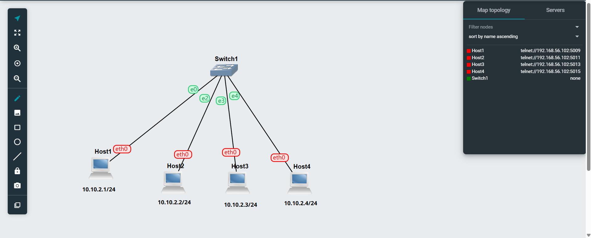
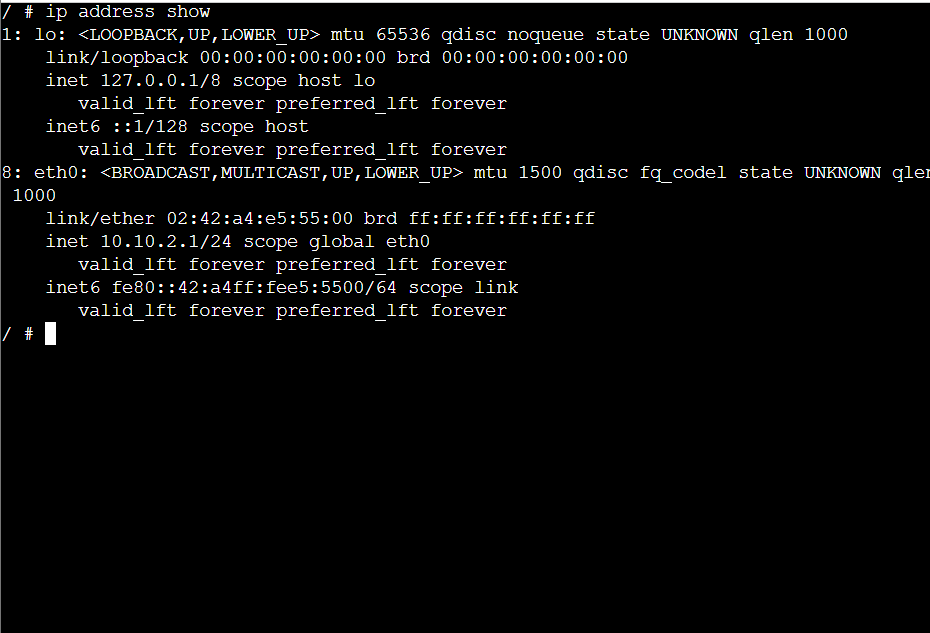
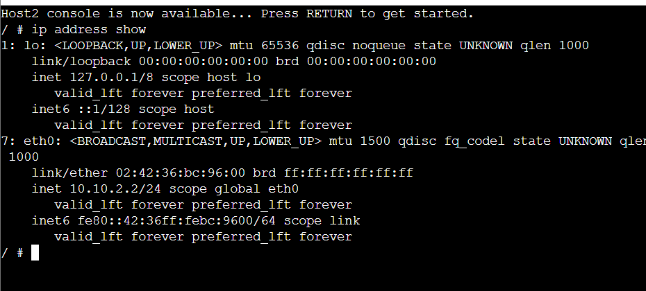
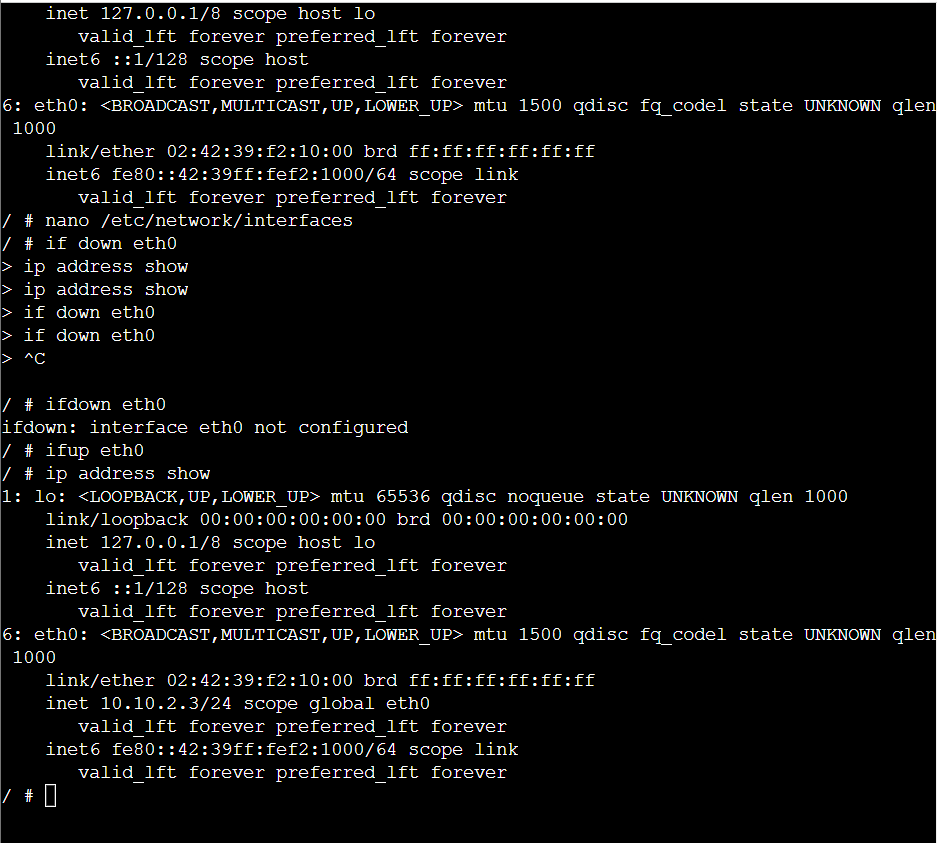
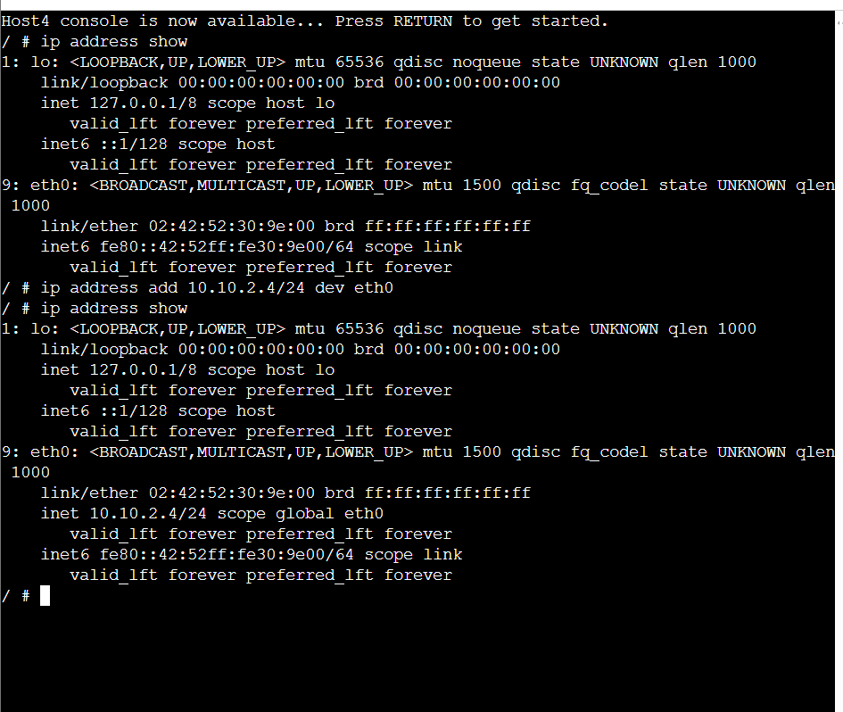
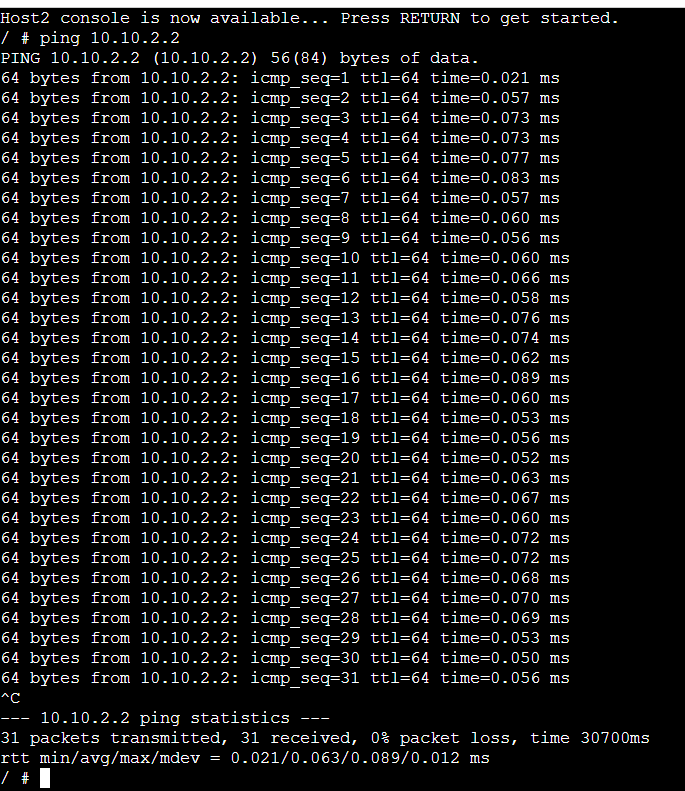
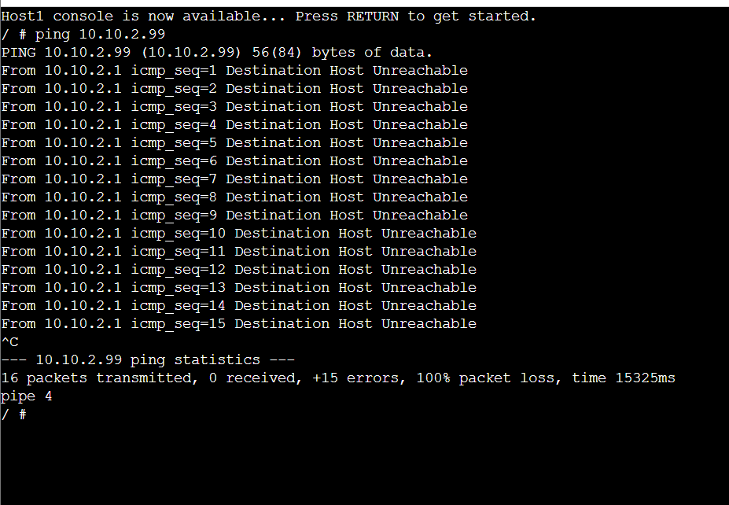
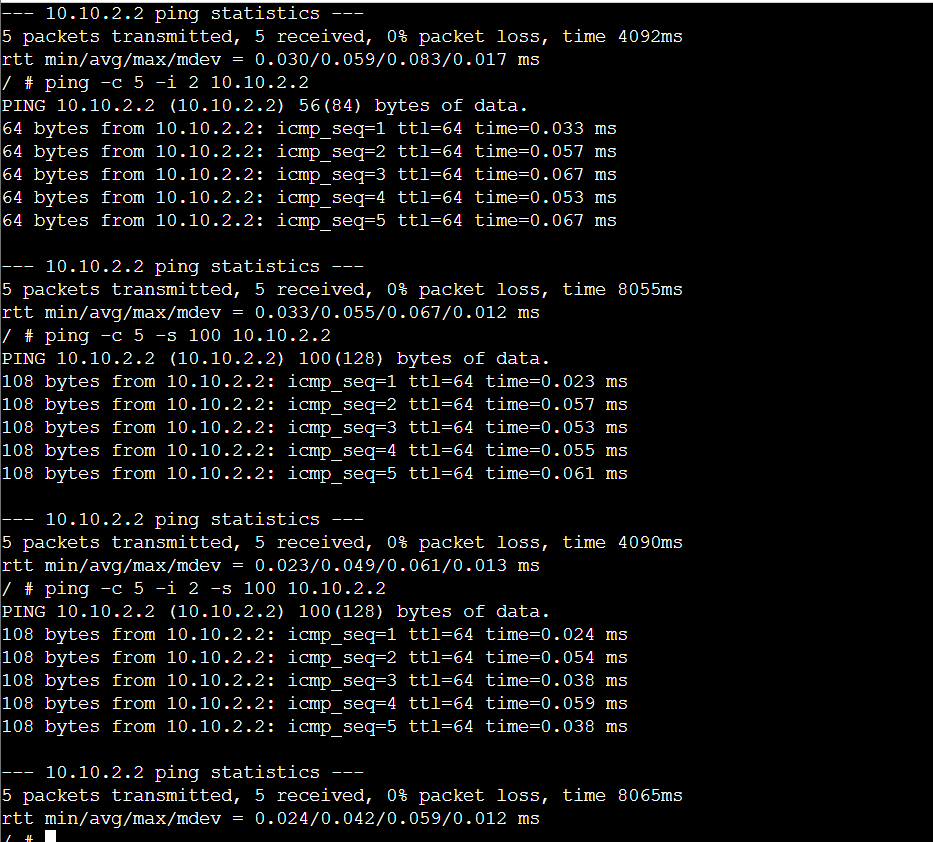

# Week 02 Tutorial – Static IP Addressing and Ping Testing

## Aim

The aim of this tutorial was to learn different methods of assigning static IP addresses to Linux hosts in GNS3. I also learned how to use the `ping` command to test connectivity, packet loss and round-trip time between devices.

---
images/setting-IP-12321415.gns3project
# Task 1 – Setting Static IP Addresses

## 1. Creating the Network

I created a new GNS3 project named:

`Setting-IP-<studentid>`


The network contained:

* Four Linux hosts
* One Ethernet switch
* All four hosts connected to the same switch

I used the following network:

`10.10.2.0/24`

The subnet mask was:

`255.255.255.0`

### Network Topology



The IP addressing plan used for the four hosts was:

| Host  | IP Address     | Configuration Method      |
| ----- | -------------- | ------------------------- |
| Host1 | `10.10.2.1/24` | GNS3 Configure menu       |
| Host2 | `10.10.2.2/24` | GNS3 Configure menu       |
| Host3 | `10.10.2.3/24` | `/etc/network/interfaces` |
| Host4 | `10.10.2.4/24` | `ip address add` command  |

---

## 2. Configuring Host1

For Host1, I used the **GNS3 Configure** option to assign the static IP address.

The configuration was:

```text
auto eth0
iface eth0 inet static
    address 10.10.2.1
    netmask 255.255.255.0
```

After starting Host1, I verified the IP address using:

```bash
ip address show
```

The output confirmed that Host1 had the address:

`10.10.2.1/24`

### Host1 IP Address



---

## 3. Configuring Host2

For Host2, I also used the **GNS3 Configure** menu.

The configuration was:

```text
auto eth0
iface eth0 inet static
    address 10.10.2.2
    netmask 255.255.255.0
```

I verified the configuration using:

```bash
ip address show
```

The output showed:

`10.10.2.2/24`

### Host2 IP Address



---

## 4. Configuring Host3 Using `/etc/network/interfaces`

Host3 was configured from the Linux console instead of using the GNS3 Configure menu.

I opened the network configuration file using:

```bash
nano /etc/network/interfaces
```

I added the following configuration:

```text
auto eth0
iface eth0 inet static
    address 10.10.2.3
    netmask 255.255.255.0
```

After saving the file, I applied the configuration using:

```bash
ifdown eth0
ifup eth0
```

I then checked the IP address using:

```bash
ip address show
```

The output confirmed:

`10.10.2.3/24`

### Host3 IP Address



This method stores the configuration in the network configuration file, so the address can remain available after restarting the host.

---

## 5. Configuring Host4 Using the `ip` Command

For Host4, I used the `ip address add` command.

The command was:

```bash
ip address add 10.10.2.4/24 dev eth0
```

I verified the IP address using:

```bash
ip address show
```

The output showed:

`10.10.2.4/24`

### Host4 IP Address



This method applies the IP address immediately. However, the configuration is temporary and will be lost if the host is restarted.

---

# Task 2 – Testing Network Connectivity and Delay with Ping

After configuring all four hosts, I used `ping` to check whether the hosts could communicate with each other.

---

## 6. Basic Ping Test

I tested connectivity from Host1 to Host2.

Host1:

`10.10.2.1`

Host2:

`10.10.2.2`

The command used was:

```bash
ping -c 5 10.10.2.2
```

The result showed five successful replies.

The summary showed:

```text
5 packets transmitted, 5 received, 0% packet loss
```

The average round-trip time was approximately:

`0.059 ms`

### Successful Ping Test



This result confirmed that Host1 and Host2 were successfully connected and could communicate through the Ethernet switch.

The **RTT (Round-Trip Time)** represents how long it takes for a packet to travel from the source to the destination and return to the source.

---

## 7. Testing a Wrong IP Address

To understand packet loss, I attempted to ping an IP address that was not assigned to any host in the network.

I used:

```bash
ping 10.10.2.99
```

I allowed the command to run for more than 10 seconds and then stopped it using `Ctrl + C`.

The result showed:

```text
0 packets received
100% packet loss
```

### Ping to an Incorrect IP Address



This showed that the destination device was not available on the network.

---

## 8. Ping with Count Option

I used the `-c` option to limit the number of ping requests.

```bash
ping -c 5 10.10.2.2
```

The option:

`-c 5`

means that only five ICMP echo requests are sent.

The test completed successfully with:

`0% packet loss`

---

## 9. Ping with Interval Option

I changed the time interval between ping requests using:

```bash
ping -c 5 -i 2 10.10.2.2
```

The option:

`-i 2`

means that the host waits two seconds between each ping request.

The result was:

```text
5 packets transmitted, 5 received, 0% packet loss
```

---

## 10. Ping with Packet Size Option

I changed the size of the ping data using:

```bash
ping -c 5 -s 100 10.10.2.2
```

The option:

`-s 100`

sets the ICMP data size to 100 bytes.

The test completed successfully with:

`0% packet loss`

---

## 11. Combining Ping Options

Finally, I combined the count, interval and packet size options in one command:

```bash
ping -c 5 -i 2 -s 100 10.10.2.2
```

The options used were:

| Option      | Purpose                  |
| ----------- | ------------------------ |
| `-c 5`      | Sends 5 ping requests    |
| `-i 2`      | Uses a 2-second interval |
| `-s 100`    | Uses 100 bytes of data   |
| `10.10.2.2` | Destination IP address   |

The result showed:

```text
5 packets transmitted, 5 received, 0% packet loss
```

### Ping with Different Options



This showed that the ping command can be modified depending on the type of network test required.

---

# Issue Encountered

During the tutorial, I initially received the following message when trying to ping Host2 from Host1:

```text
Destination Host Unreachable
```

I checked the IP addresses on both hosts and confirmed that they were configured correctly.

I also checked the Ethernet interfaces using:

```bash
ip link show eth0
```

The interfaces were active, but the hosts were still unable to communicate.

I then checked and corrected the connections between the Linux hosts and the Ethernet switch. After fixing the switch connections, I tested again using:

```bash
ping -c 5 10.10.2.2
```

The ping was successful and showed:

```text
5 packets transmitted, 5 received, 0% packet loss
```

This troubleshooting process helped me understand that both correct IP addressing and correct network connections are required for communication between devices.

---

# Files Produced

The following files were created as part of this tutorial:

* `Setting-IP-<studentid>.gns3project`
* `Setting-IP-<studentid>-network.png`
* `Setting-IP-<studentid>-host1.png`
* `Setting-IP-<studentid>-host2.png`
* `Setting-IP-<studentid>-host3.png`
* `Setting-IP-<studentid>-host4.png`
* `Ping-Basics-<studentid>-simple.png`
* `Ping-Basics-<studentid>-error.png`
* `Ping-Basics-<studentid>-options.png`

---

# Reflection

In this tutorial, I learned three different ways of assigning static IP addresses to Linux hosts. I understood that using the GNS3 Configure menu and `/etc/network/interfaces` can keep the configuration after restarting, while the `ip address add` command only provides a temporary IP address.

I also learned how to use `ping` to check whether another host is reachable, measure round-trip time and identify packet loss. The connectivity problem I faced during the activity also gave me useful troubleshooting experience because I had to check the IP addresses, interfaces and switch connections before finding the problem.

Overall, this tutorial improved my understanding of basic Linux networking, static IP configuration and connectivity testing in GNS3.
