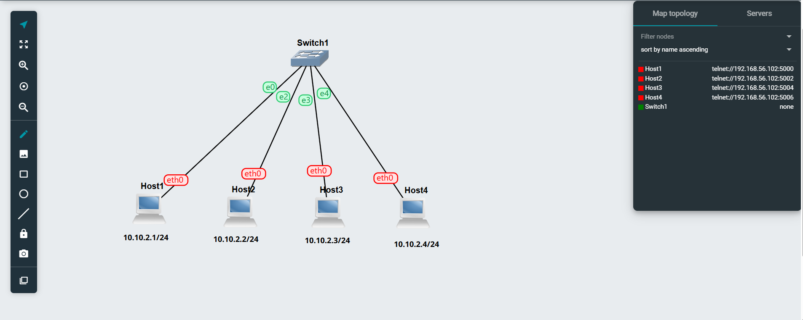

# Week 03 Tutorial – Netcat Communication and Packet Capture

## Overview

In this tutorial, I learned how to use Netcat (`nc`) for simple communication between two Linux hosts. I also learned how to capture network packets in GNS3 and transfer the captured `.pcap` file from the GNS3 virtual machine to my Windows computer using FileZilla.

For this tutorial, I continued using the GNS3 network created in Week 02.

The network contained four Linux hosts connected through one Ethernet switch.

The IP addresses used were:

* Host1: `10.10.2.1/24`
* Host2: `10.10.2.2/24`
* Host3: `10.10.2.3/24`
* Host4: `10.10.2.4/24`

  

---

# Task 1 – Simple Application Communication with Netcat

## Step 1 – Checking Network Connectivity

Before starting Netcat, I checked that Host1 could communicate with Host2.

From Host1, I used:

```bash
ping -c 3 10.10.2.2
```

The result showed:

```text
3 packets transmitted, 3 received, 0% packet loss
```

This confirmed that the two hosts were connected correctly and could communicate through the network.

---

## Step 2 – Starting the Netcat Server

I used Host1 as the Netcat server.

The tutorial required a port other than `12345`, so I selected port:

```text
23456
```

On Host1, I entered:

```bash
nc -l -p 23456
```

The `-l` option places Netcat into listening mode, and `-p 23456` tells it to listen on port 23456.

After running the command, the console remained blank because the server was waiting for a client to connect.

---

## Step 3 – Connecting the Netcat Client

I used Host2 as the Netcat client.

On Host2, I entered:

```bash
nc 10.10.2.1 23456
```

Here:

* `10.10.2.1` is the IP address of Host1.
* `23456` is the port being used by the Netcat server.

After running this command, Host2 successfully connected to Host1.

---

## Step 4 – Sending My Name from Client to Server

On the Host2 client console, I typed my name and pressed Enter.

The same message appeared on the Host1 server console.

This confirmed that application-level communication from the client to the server was working correctly.

---

## Step 5 – Sending Student ID from Server to Client

Next, I typed my student ID on the Host1 server console and pressed Enter.

The student ID appeared on the Host2 client console.

This confirmed that communication was working in both directions.

---

## Netcat Client and Server Evidence

I opened the Host1 and Host2 consoles in separate browser windows so that both could be shown in one screenshot.

The screenshot included:

* Netcat server command
* Netcat client command
* Port number
* My name
* My student ID
* Messages displayed on both hosts


The screenshot was saved as:

```text
Netcat-Basics-<studentid>-client-server.png
```

After completing the test, I stopped Netcat.

---

# Task 2 – Capturing Packets

## Step 1 – Preparing the Network

For the packet capture task, I used:

* Host1 as Host A
* Host2 as Host B
* Host3 as Host C

Before starting the capture, I checked that the hosts were reachable.

From Host1, I tested Host2 using:

```bash
ping -c 3 10.10.2.2
```

I also checked Host3 using:

```bash
ping -c 3 10.10.2.3
```

This helped confirm that the network was working before starting the packet capture.

---

## Step 2 – Starting Packet Capture

In the GNS3 topology, I located the link between Host1 and the Ethernet switch.

I right-clicked directly on the link and selected:

**Start Capture**

The capture was started on the Ethernet link between Host1 and Switch1.

I saved the capture using the required filename:

```text
Capture-Basics-<studentid>-ping-netcat.pcap
```

---

## Step 3 – Generating Ping Traffic

While the packet capture was running, I opened the Host1 console and sent exactly three ping requests to Host2.

I used:

```bash
ping -c 3 10.10.2.2
```

The result showed three successful replies and `0% packet loss`.

These ICMP packets were recorded in the packet capture.

---

## Step 4 – Starting Netcat on Host3

For the second part of the capture, I used Host3 as the Netcat server.

I selected another port and entered:

```bash
nc -l -p 34567
```

Host3 then waited for a connection from Host1.

---

## Step 5 – Connecting Host1 to Host3

On Host1, I entered:

```bash
nc 10.10.2.3 34567
```

This connected Host1 to the Netcat server running on Host3.

---

## Step 6 – Sending My Name Using Netcat

From Host1, I typed my name and pressed Enter.

The message appeared on Host3.

This generated application-level TCP traffic while the GNS3 packet capture was still running.

Therefore, the final capture included both:

```text
ICMP traffic from ping
TCP traffic from Netcat
```

---

## Step 7 – Stopping the Packet Capture

After completing the ping and Netcat tests, I returned to the GNS3 topology.

I right-clicked the same link between Host1 and Switch1 and selected:

**Stop Capture**

This completed the packet capture.

The required file was:

```text
Capture-Basics-<studentid>-ping-netcat.pcap
```

---

# Transferring the Capture File to Windows

## Step 8 – Connecting to GNS3 Using FileZilla

The `.pcap` file was stored inside the GNS3 virtual machine.

I used FileZilla Client to connect to the GNS3 VM using SFTP.

The connection settings used were:

```text
Protocol: SFTP
Port: 22
Username: gns3
Password: gns3
```

After entering the GNS3 VM IP address, FileZilla connected successfully.

---

## Step 9 – Finding the GNS3 Project Folder

In FileZilla, I navigated to:

```text
/opt/gns3/projects/
```

I located the folder belonging to my GNS3 project.

Inside the project directory, I opened:

```text
project-files/captures
```

The capture folder contained the `.pcap` files generated by GNS3.

---

## Step 10 – Copying the PCAP File

I located the required capture:

```text
Capture-Basics-<studentid>-ping-netcat.pcap
```

I transferred the file from the GNS3 server to my Windows computer using FileZilla.

The capture file was then available locally for checking in Wireshark.

---

# Output Files

The final files produced for Week 03 were:

```text
Netcat-Basics-<studentid>-client-server.png
Capture-Basics-<studentid>-ping-netcat.pcap
```

The first file provides evidence of the Netcat client/server communication.

The second file contains the packets captured while performing the ping and Netcat activities.

---

# Issue Encountered

During the tutorial, I initially had a connectivity problem where Host1 and Host2 returned:

```text
Destination Host Unreachable
```

I checked the IP addresses, network interfaces and links between the hosts. After restarting the GNS3 environment and checking the network configuration again, communication started working correctly.

I also made a small mistake while starting the Netcat server by entering the number `1` instead of the lowercase letter `l`. The incorrect command did not work, and I corrected it to:

```bash
nc -l -p 23456
```

Another issue occurred when transferring the packet capture because I first looked in the wrong FileZilla directory. I later found the correct project folder under:

```text
/opt/gns3/projects/
```

and successfully located the capture inside the `project-files/captures` directory.

These issues helped me understand how to troubleshoot connectivity, command syntax and file locations in GNS3.

---

# Reflection

This tutorial helped me understand the difference between using `ping` and Netcat for testing network communication. Ping uses ICMP to check whether another device is reachable, whereas Netcat can create a client-server connection and send application-level messages between hosts.

I also learned how packet capture works in GNS3. By capturing the link connected to Host1, I was able to record both ping and Netcat traffic in a `.pcap` file. Transferring the file using FileZilla also gave me experience working with files stored inside the GNS3 virtual machine.

The troubleshooting I completed during this tutorial was also useful because it showed me that network problems can be caused by IP configuration, virtual links, command syntax or the GNS3 environment itself.
