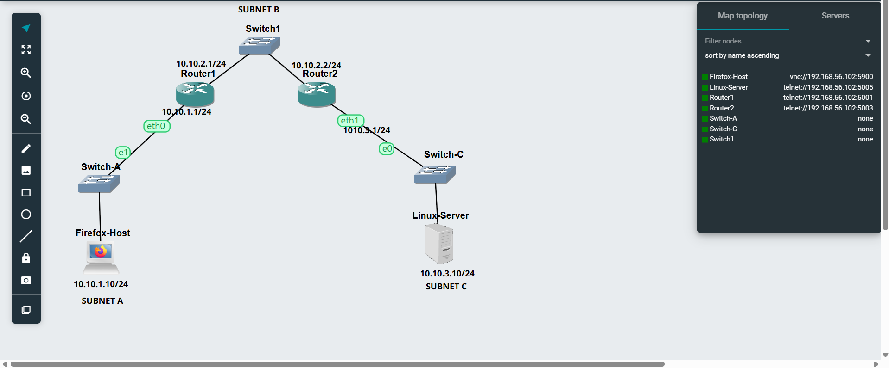
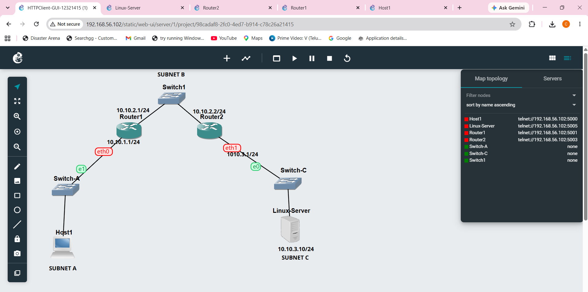
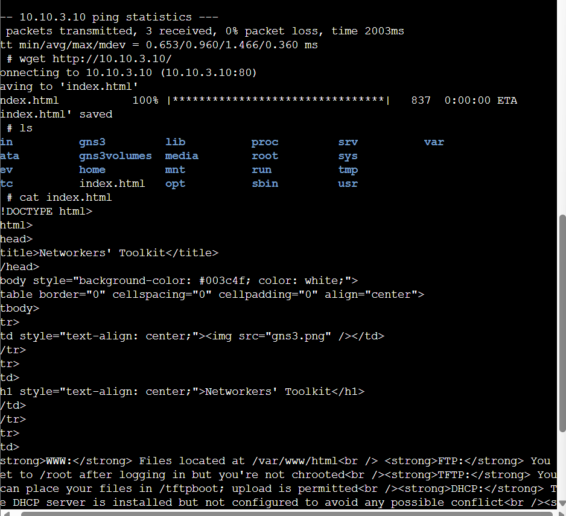
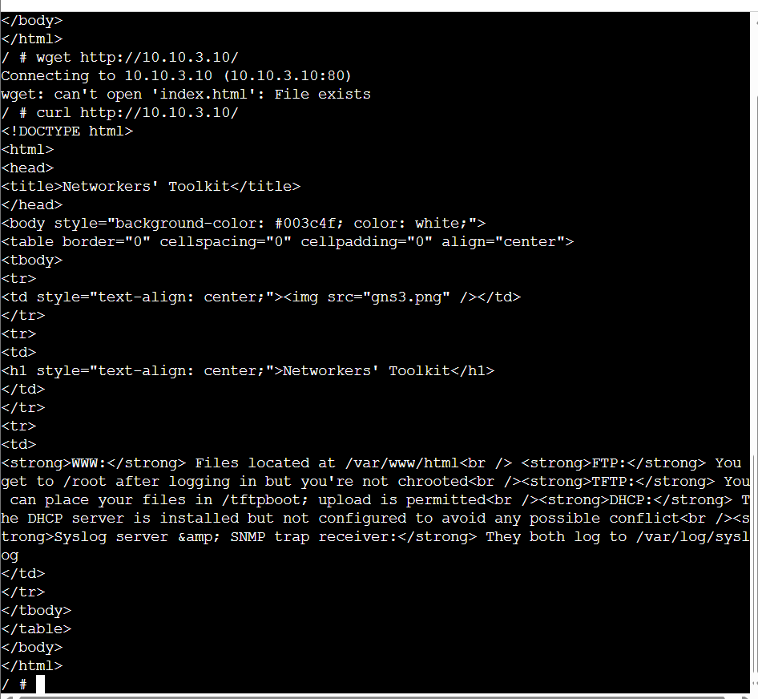

# Week 04 Tutorial – HTTP Client Communication

## Overview

In this tutorial, I learned how HTTP communication works when a client and server are located in different subnets. I created a network using two Linux routers, three Ethernet switches, one client and one Linux Server.

The tutorial had two tasks. In Task 1, I used a Firefox Host as a graphical HTTP client. In Task 2, I replaced the Firefox Host with a Linux Host and used `wget` and `curl` from the command line.

I also worked with static IP addresses, default gateways, static routes, IP forwarding, VNC, packet capturing and FileZilla.

---

# Network Addressing

I used three different subnets.

```text
Subnet A: 10.10.1.0/24
Subnet B: 10.10.2.0/24
Subnet C: 10.10.3.0/24
```

The IP addresses used were:

```text
Firefox Host / Host1: 10.10.1.10/24

Router1 eth0: 10.10.1.1/24
Router1 eth1: 10.10.2.1/24

Router2 eth0: 10.10.2.2/24
Router2 eth1: 10.10.3.1/24

Linux Server: 10.10.3.10/24
```

The client used the following default gateway:

```text
10.10.1.1
```

The Linux Server used:

```text
10.10.3.1
```

---

# Task 1 – HTTP Client with GUI

## Step 1 – Creating the Project

I created a new GNS3 project named:

```text
HTTPClient-GUI-12321415
```


I added the following devices:

* One Firefox Host
* Two Linux Routers
* Three Ethernet switches
* One Linux Server

---

## Step 2 – Creating the Network

I connected the devices in the following order:

```text
Firefox Host
     |
  Switch-A
     |
  Router1
     |
  Switch-B
     |
  Router2
     |
  Switch-C
     |
Linux Server
```

The network was divided into three subnets.

Subnet A contained the Firefox Host, Switch-A and Router1.

Subnet B connected Router1 and Router2 using Switch-B.

Subnet C contained Router2, Switch-C and the Linux Server.

---

## Step 3 – Configuring Firefox Host

I configured the Firefox Host with:

```text
IP Address: 10.10.1.10
Subnet Mask: 255.255.255.0
Default Gateway: 10.10.1.1
```

This placed the Firefox Host in Subnet A.

---

## Step 4 – Configuring Router1

Router1 connected Subnet A and Subnet B.

I configured:

```text
eth0: 10.10.1.1/24
eth1: 10.10.2.1/24
```

I checked the configuration using:

```bash
ip address show
```

---

## Step 5 – Configuring Router2

Router2 connected Subnet B and Subnet C.

I configured:

```text
eth0: 10.10.2.2/24
eth1: 10.10.3.1/24
```

I checked the configuration using:

```bash
ip address show
```

---

## Step 6 – Configuring Linux Server

The Linux Server was configured with:

```text
IP Address: 10.10.3.10/24
Default Gateway: 10.10.3.1
```

I checked the IP address using:

```bash
ip address show eth0
```

I also checked the routing table using:

```bash
ip route show
```

The correct default route was:

```text
default via 10.10.3.1 dev eth0
```

---

## Step 7 – Enabling IP Forwarding

Router1 and Router2 needed IP forwarding so that they could forward packets between different subnets.

I checked IP forwarding using:

```bash
cat /proc/sys/net/ipv4/ip_forward
```

The required value was:

```text
1
```

If the value was `0`, I enabled forwarding using:

```bash
echo 1 > /proc/sys/net/ipv4/ip_forward
```

I performed this check on both routers.

---

## Step 8 – Adding Static Route on Router1

Router1 needed a route to Subnet C.

I added:

```bash
ip route add 10.10.3.0/24 via 10.10.2.2
```

I checked it using:

```bash
ip route show
```

The routing table showed:

```text
10.10.3.0/24 via 10.10.2.2 dev eth1
```

---

## Step 9 – Adding Static Route on Router2

Router2 needed a route back to Subnet A.

I added:

```bash
ip route add 10.10.1.0/24 via 10.10.2.1
```

I verified it using:

```bash
ip route show
```

The routing table showed:

```text
10.10.1.0/24 via 10.10.2.1
```

---

## Step 10 – Testing Router Connectivity

Before using HTTP, I checked communication between Router1 and Router2.

From Router1, I used:

```bash
ping -c 3 10.10.2.2
```

The result showed:

```text
3 packets transmitted, 3 received, 0% packet loss
```

This confirmed that Subnet B was working correctly.

---

## Step 11 – Testing Linux Server Connectivity

From Router1, I tested the Linux Server.

```bash
ping -c 3 10.10.3.10
```

The result showed:

```text
3 packets transmitted, 3 received, 0% packet loss
```

This confirmed that Router1 could communicate with the server through Router2.

---

## Step 12 – Checking the HTTP Server

I checked whether the Linux Server was listening on TCP port 80.

I used:

```bash
ss -lntp | grep ':80'
```

The output showed nginx listening on port 80.

```text
0.0.0.0:80
```

This confirmed that the HTTP server was running.

---

## Step 13 – Opening Firefox Host

The Firefox Host used a graphical VNC console.

I initially could not open it using the GNS3 web console, so I used TightVNC Viewer.

I connected to the VNC address shown by GNS3 and successfully opened the Firefox Host desktop.

---

## Step 14 – Taking the GUI Network Screenshot

I arranged all devices clearly in the GNS3 workspace and took a screenshot of the topology.

The screenshot was saved as:

```text
HTTPClient-GUI-12321415-network.png
```

### Network Screenshot



---

## Step 15 – Starting Packet Capture

Before accessing the website, I started a packet capture on a link in Subnet B.

I used the link:

```text
Router1 ↔ Switch-B
```

I right-clicked the link and selected:

```text
Start Capture
```

The capture file was named:

```text
HTTPClient-GUI-12321415-subnetB.pcap
```

---

## Step 16 – Accessing the Website with Firefox

Inside the Firefox Host, I opened Firefox and used:

```text
http://10.10.3.10/
```

The Networkers' Toolkit webpage loaded successfully.

This confirmed that HTTP communication worked from the Firefox Host in Subnet A to the Linux Server in Subnet C.

The communication travelled through:

```text
Firefox Host
     |
  Router1
     |
  Subnet B
     |
  Router2
     |
Linux Server
```

---

## Step 17 – Stopping the Packet Capture

After the webpage loaded, I returned to GNS3.

I right-clicked the same Subnet B link and selected:

```text
Stop Capture
```

The final Task 1 packet capture was:

```text
HTTPClient-GUI-12321415-subnetB.pcap
```

---


# Task 2 – HTTP Client with Command Line Interface

## Step 1 – Creating the CLI Project

For Task 2, I created a copy of the GUI project.

I named the new project:

```text
HTTPClient-CLI-12321415
```

.gns3project)

This allowed me to keep the Task 1 project unchanged.

---

## Step 2 – Replacing Firefox Host

I removed the Firefox Host from Subnet A.

I then added a normal Linux Host and named it:

```text
Host1
```

I connected Host1 to Switch-A.

The topology became:

```text
Host1
  |
Switch-A
  |
Router1
  |
Switch-B
  |
Router2
  |
Switch-C
  |
Linux Server
```

---

## Step 3 – Configuring Host1

The Linux Host used the same IP address as the Firefox Host.

I configured:

```text
IP Address: 10.10.1.10/24
Default Gateway: 10.10.1.1
```

I checked the IP address using:

```bash
ip address show eth0
```

I also checked the routing table using:

```bash
ip route show
```

The default route was:

```text
default via 10.10.1.1 dev eth0
```

---

## Step 4 – Checking Router Routes Again

Because some routes were added manually, I checked Router1 again.

```bash
ip route show
```

Router1 needed:

```text
10.10.3.0/24 via 10.10.2.2
```

If the route was missing, I added:

```bash
ip route add 10.10.3.0/24 via 10.10.2.2
```

On Router2, I checked:

```bash
ip route show
```

Router2 needed:

```text
10.10.1.0/24 via 10.10.2.1
```

If it was missing, I added:

```bash
ip route add 10.10.1.0/24 via 10.10.2.1
```

---

## Step 5 – Checking IP Forwarding

I checked IP forwarding on both routers.

```bash
cat /proc/sys/net/ipv4/ip_forward
```

The value needed to be:

```text
1
```

If required, I enabled it using:

```bash
echo 1 > /proc/sys/net/ipv4/ip_forward
```

---

## Step 6 – Testing Host1 to Router1

From Host1, I tested the local gateway.

```bash
ping -c 3 10.10.1.1
```

The result showed:

```text
3 packets transmitted, 3 received, 0% packet loss
```

This confirmed that Host1 could communicate with Router1.

---

## Step 7 – Testing Host1 to Linux Server

I then tested the Linux Server from Host1.

```bash
ping -c 3 10.10.3.10
```

The result showed:

```text
3 packets transmitted, 3 received, 0% packet loss
```

This confirmed that Host1 could reach the server through both routers.

---

## Step 8 – Checking nginx on Linux Server

At one stage, the HTTP connection returned:

```text
Connection refused
```

I checked the Linux Server using:

```bash
ss -lntp | grep ':80'
```

I found that nginx was not running because its log directory was missing.

I created the required directory using:

```bash
mkdir -p /var/log/nginx
```

I created the required log files using:

```bash
touch /var/log/nginx/error.log
touch /var/log/nginx/access.log
```

I then started nginx again.

After this, I checked port 80:

```bash
ss -lntp | grep ':80'
```

The output showed that nginx was listening successfully.

---

## Step 9 – Taking the CLI Network Screenshot

I arranged the Task 2 topology clearly and saved a screenshot.

The screenshot was named:

```text
HTTPClient-CLI-12321415-network.png
```

### CLI Network Screenshot



---

## Step 10 – Starting the CLI Packet Capture

Before using `wget`, I started a new packet capture on the Subnet B link.

I used:

```text
Router1 ↔ Switch-B
```

The capture was saved as:

```text
HTTPClient-CLI-12321415-subnetB.pcap
```

---

## Step 11 – Using wget

On Host1, I used:

```bash
wget http://10.10.3.10/
```

The webpage was downloaded as:

```text
index.html
```

I checked the file using:

```bash
ls
```

I then displayed the webpage source using:

```bash
cat index.html
```

The output contained the HTML for the Networkers' Toolkit webpage.

This confirmed that `wget` successfully accessed and downloaded the webpage from the Linux Server.

---

## wget Evidence

The screenshot showing the successful `wget` command was saved as:

```text
HTTPClient-CLI-12321415-wget.png
```



---

## Step 12 – Stopping the Packet Capture

After completing the `wget` request, I returned to GNS3.

I right-clicked the same Subnet B link and selected:

```text
Stop Capture
```

The Task 2 capture file was:

```text
HTTPClient-CLI-12321415-subnetB.pcap
```


## Step 13 – Using curl

After stopping the packet capture, I tested the web server using `curl`.

I entered:

```bash
curl http://10.10.3.10/
```

The HTML content of the Networkers' Toolkit webpage was displayed directly in the terminal.

The output included:

```html
<title>Networkers' Toolkit</title>
```

This confirmed that `curl` was able to access the web server successfully.

---

## curl Evidence

The screenshot showing the successful `curl` command was saved as:

```text
HTTPClient-CLI-12321415-curl.png
```



---

# Transferring Packet Capture Files

## Step 14 – Connecting FileZilla

The packet capture files were stored inside the GNS3 virtual machine.

I used FileZilla Client and connected using SFTP.

The connection settings were:

```text
Protocol: SFTP
Port: 22
Username: gns3
Password: gns3
```

I entered the GNS3 VM IP address as the host.

---

## Step 15 – Finding the Capture Directory

After connecting with FileZilla, I navigated to:

```text
/opt/gns3/projects/
```

I found the correct GNS3 project directory.

Inside the project, I opened:

```text
project-files/captures
```

This folder contained the packet capture files created in GNS3.

---

## Step 16 – Copying the PCAP Files

I copied the following files from the GNS3 VM to my Windows computer:

```text
HTTPClient-GUI-12321415-subnetB.pcap
HTTPClient-CLI-12321415-subnetB.pcap
```

I could then open the files in Wireshark to check the captured packets.

---

# Output Files

## Task 1 – GUI

The final Task 1 files were:

```text
HTTPClient-GUI-12321415.gns3project
HTTPClient-GUI-12321415-network.png
HTTPClient-GUI-12321415-subnetB.pcap
```

---

## Task 2 – CLI

The final Task 2 files were:

```text
HTTPClient-CLI-12321415.gns3project
HTTPClient-CLI-12321415-network.png
HTTPClient-CLI-12321415-subnetB.pcap
HTTPClient-CLI-12321415-wget.png
HTTPClient-CLI-12321415-curl.png
```

---

# Issues Encountered

During this tutorial, I faced a few problems while setting up the network.

One issue occurred between Router1 and Router2. Both routers had IP addresses configured, but they were initially unable to communicate across Subnet B. I checked the Ethernet links, IP addresses, switch configuration and interfaces. After correcting the connection, both routers were able to ping each other successfully.

Another issue was that manually added static routes disappeared after restarting the routers. I checked the routing tables again and added the required routes when necessary.

I also had difficulty opening the Firefox Host using the GNS3 web console. I used TightVNC Viewer instead, which allowed me to access the Firefox graphical desktop.

The Linux Server also had an incorrect default gateway during testing. I corrected it to:

```text
10.10.3.1
```

Another issue occurred when nginx failed to start because the `/var/log/nginx` directory was missing.

I fixed this using:

```bash
mkdir -p /var/log/nginx
touch /var/log/nginx/error.log
touch /var/log/nginx/access.log
```

After this, nginx successfully started and listened on HTTP port 80.

While testing `wget`, I also received a message because `index.html` already existed. I removed the existing file using:

```bash
rm -f index.html
```

and ran `wget` again.

These problems helped me understand the importance of checking each part of the network separately when troubleshooting.

---

# Reflection

This tutorial helped me understand how HTTP communication works across different networks.

I learned that devices in different subnets cannot communicate correctly unless the routers have the correct IP addresses, static routes and IP forwarding enabled. I also understood the importance of setting the correct default gateway on both the client and the server.

Using Firefox showed me how a normal graphical HTTP client accesses a web server. Using `wget` and `curl` helped me understand how HTTP requests can also be made from the command line.

I also gained more practical experience with GNS3 packet capture, Wireshark, VNC and FileZilla.

The troubleshooting part of this tutorial was useful because I had to check IP addresses, routes, switch connections, gateways and the HTTP service separately. This helped me understand a better step-by-step approach to solving networking problems.
