# Week 05 Tutorial – Routing Tables and Dynamic Routing with OSPF

## Overview

In this tutorial, I learned how routing tables are used to send packets between different networks. I also learned how IP forwarding works on a Linux Router and how a default gateway helps a host communicate with devices outside its own network.

The tutorial had two tasks. In Task 1, I created a network with three Linux Hosts, one Linux Router and one Ethernet switch. The network was divided into two subnets, and I checked the IP addresses, forwarding settings and routing tables of each device.

In Task 2, I used a provided OSPF network containing four FRR routers. I checked OSPF neighbours and routing tables and used `traceroute` to see the path between two hosts. I then stopped a NETem node on the active path and observed how OSPF automatically selected another route.

---

# Task 1 – View Routing Tables

## Step 1 – Creating the Project

I created a new GNS3 project named:

```text
View-Routes-12321415
```


I added the following devices:

- Three Linux Hosts
- One Linux Router
- One Ethernet switch

I named the Linux Hosts:

```text
Host1
Host2
Host3
```

The router was named:

```text
Router1
```

---

## Step 2 – Creating the Network

I connected Host1 and Host2 to the Ethernet switch.

The Ethernet switch was connected to Router1.

Host3 was connected directly to the second interface of Router1.

The network was arranged as:

```text
Host1 --------\
               \
                Switch1 -------- Router1 -------- Host3
               /
Host2 --------/
```

This created two different subnets.

Subnet A contained Host1, Host2, Switch1 and the first interface of Router1.

Subnet B contained the second interface of Router1 and Host3.

---

# Network Addressing

I used two different subnets.

```text
Subnet A: 10.10.5.0/24
Subnet B: 10.10.6.0/24
```

The IP addresses used were:

```text
Host1 eth0: 10.10.5.10/24
Host2 eth0: 10.10.5.20/24

Router1 eth0: 10.10.5.1/24
Router1 eth1: 10.10.6.1/24

Host3 eth0: 10.10.6.10/24
```

Host1 and Host2 used the following default gateway:

```text
10.10.5.1
```

Host3 used:

```text
10.10.6.1
```

---

## Step 3 – Configuring Host1

Before starting Host1, I opened its network configuration.

I configured Host1 with:

```text
auto eth0
iface eth0 inet static
    address 10.10.5.10
    netmask 255.255.255.0
    gateway 10.10.5.1
    up sysctl -w net.ipv4.ip_forward=0
```

This placed Host1 in Subnet A.

IP forwarding was disabled because Host1 was being used as a normal end device.

---

## Step 4 – Configuring Host2

I configured Host2 with:

```text
auto eth0
iface eth0 inet static
    address 10.10.5.20
    netmask 255.255.255.0
    gateway 10.10.5.1
    up sysctl -w net.ipv4.ip_forward=0
```

Host2 was also part of Subnet A.

The default gateway was Router1 at:

```text
10.10.5.1
```

---

## Step 5 – Configuring Host3

Host3 was connected directly to Router1 and was part of Subnet B.

I configured Host3 with:

```text
auto eth0
iface eth0 inet static
    address 10.10.6.10
    netmask 255.255.255.0
    gateway 10.10.6.1
    up sysctl -w net.ipv4.ip_forward=0
```

The default gateway of Host3 was:

```text
10.10.6.1
```

---

## Step 6 – Configuring Router1

Router1 connected Subnet A and Subnet B.

I configured the first interface as:

```text
eth0: 10.10.5.1/24
```

and the second interface as:

```text
eth1: 10.10.6.1/24
```

The complete configuration was:

```text
auto eth0
iface eth0 inet static
    address 10.10.5.1
    netmask 255.255.255.0

auto eth1
iface eth1 inet static
    address 10.10.6.1
    netmask 255.255.255.0

    up sysctl -w net.ipv4.ip_forward=1
```

IP forwarding was enabled on Router1 because it needed to forward packets between the two subnets.

Router1 did not require a default gateway because it was the only router in this network.

---

## Step 7 – Starting All Nodes

After completing the network configuration, I started:

```text
Host1
Host2
Host3
Router1
```

I waited until all devices were running before checking the IP addresses and routing tables.

---

## Step 8 – Checking Host1 IP Address

On Host1, I checked the IP address using:

```bash
ip address show eth0
```

The interface showed:

```text
10.10.5.10/24
```

I also checked whether IP forwarding was disabled using:

```bash
sysctl net.ipv4.ip_forward
```

The result was:

```text
net.ipv4.ip_forward = 0
```

This confirmed that Host1 was correctly configured as an end host.


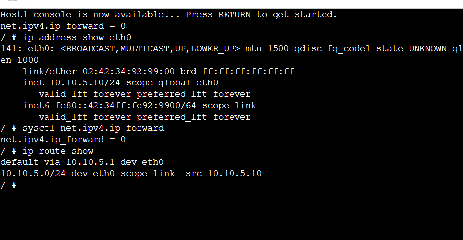
---

## Step 9 – Checking Host1 Routing Table

On Host1, I entered:

```bash
ip route show
```

The routing table showed:

```text
default via 10.10.5.1 dev eth0
10.10.5.0/24 dev eth0
```

This showed that the `10.10.5.0/24` network was directly connected.

Traffic going to another network was sent to the default gateway:

```text
10.10.5.1
```

---

## Step 10 – Checking Host2

On Host2, I checked the IP address using:

```bash
ip address show eth0
```

The address was:

```text
10.10.5.20/24
```

I checked the routing table using:

```bash
ip route show
```

The routing table showed:

```text
default via 10.10.5.1 dev eth0
10.10.5.0/24 dev eth0
```

I also checked IP forwarding:

```bash
sysctl net.ipv4.ip_forward
```

The result was:

```text
net.ipv4.ip_forward = 0
```


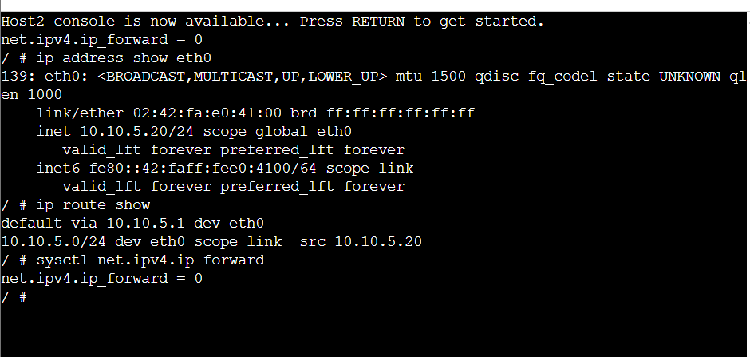
---

## Step 11 – Checking Host3

On Host3, I checked the IP address using:

```bash
ip address show eth0
```

The address was:

```text
10.10.6.10/24
```

I checked the routing table using:

```bash
ip route show
```

The routing table showed:

```text
default via 10.10.6.1 dev eth0
10.10.6.0/24 dev eth0
```

I also checked forwarding using:

```bash
sysctl net.ipv4.ip_forward
```

The result was:

```text
net.ipv4.ip_forward = 0
```

This confirmed that Host3 was also configured as a normal end host.


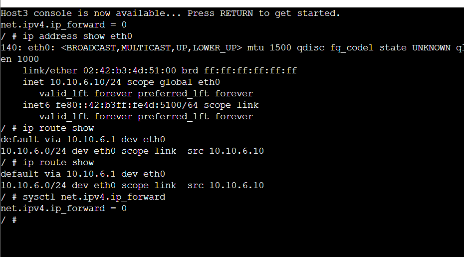
---

## Step 12 – Checking Router1

On Router1, I checked the interface addresses using:

```bash
ip address show
```

The router had:

```text
eth0: 10.10.5.1/24
eth1: 10.10.6.1/24
```

I checked IP forwarding using:

```bash
sysctl net.ipv4.ip_forward
```

The result was:

```text
net.ipv4.ip_forward = 1
```

This confirmed that Router1 was able to forward packets between the two networks.


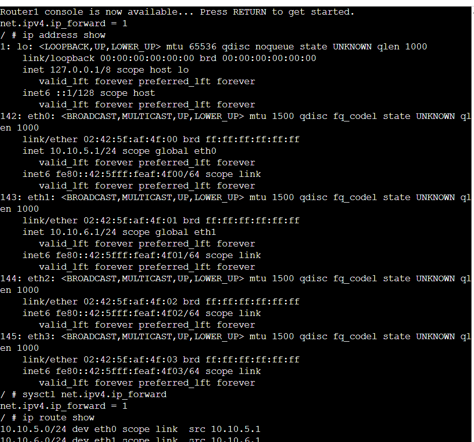
---

## Step 13 – Viewing Router1 Routing Table

On Router1, I entered:

```bash
ip route show
```

The routing table showed:

```text
10.10.5.0/24 dev eth0
10.10.6.0/24 dev eth1
```

Both networks were directly connected to Router1.

Because both networks were directly connected, I did not need to manually add any static routes.

---

# Routing Table Summary

I recorded the routing information of all devices.

| Device | IP Address | Destination | Next Node |
|---|---|---|---|
| Host1 | `10.10.5.10/24` | `10.10.5.0/24` | Directly connected |
| Host1 | `10.10.5.10/24` | Default | `10.10.5.1` |
| Host2 | `10.10.5.20/24` | `10.10.5.0/24` | Directly connected |
| Host2 | `10.10.5.20/24` | Default | `10.10.5.1` |
| Host3 | `10.10.6.10/24` | `10.10.6.0/24` | Directly connected |
| Host3 | `10.10.6.10/24` | Default | `10.10.6.1` |
| Router1 | `10.10.5.1/24` | `10.10.5.0/24` | Directly connected |
| Router1 | `10.10.6.1/24` | `10.10.6.0/24` | Directly connected |

---

## Step 14 – Testing Host1 to Host2

Before testing communication between different subnets, I tested Host1 and Host2.

From Host1, I entered:

```bash
ping -c 3 10.10.5.20
```

The result showed:

```text
3 packets transmitted, 3 received, 0% packet loss
```

This confirmed that Host1 and Host2 could communicate successfully inside Subnet A.

---

## Step 15 – Testing Host1 to Router1

From Host1, I tested the default gateway using:

```bash
ping -c 3 10.10.5.1
```

The ping was successful.

This confirmed that Host1 could communicate with Router1.

---

## Step 16 – Testing Router1 to Host3

From Router1, I entered:

```bash
ping -c 3 10.10.6.10
```

The ping was successful.

This confirmed that Router1 could communicate with Host3 on Subnet B.

---

## Step 17 – Testing Communication Between the Two Subnets

The main test was communication from Host1 in Subnet A to Host3 in Subnet B.

From Host1, I entered:

```bash
ping -c 3 10.10.6.10
```

The result showed:

```text
3 packets transmitted, 3 received, 0% packet loss
```

This confirmed that Router1 was correctly forwarding packets between the two different subnets.

The communication travelled through:

```text
Host1
10.10.5.10
     |
     |
Router1
10.10.5.1 / 10.10.6.1
     |
     |
Host3
10.10.6.10
```

---

## Step 18 – Taking the Network Screenshot

I arranged all devices clearly in the GNS3 workspace and took a screenshot of the completed topology.

The screenshot was saved as:

```text
View-Routes-12321415-network.png
```

### Network Screenshot

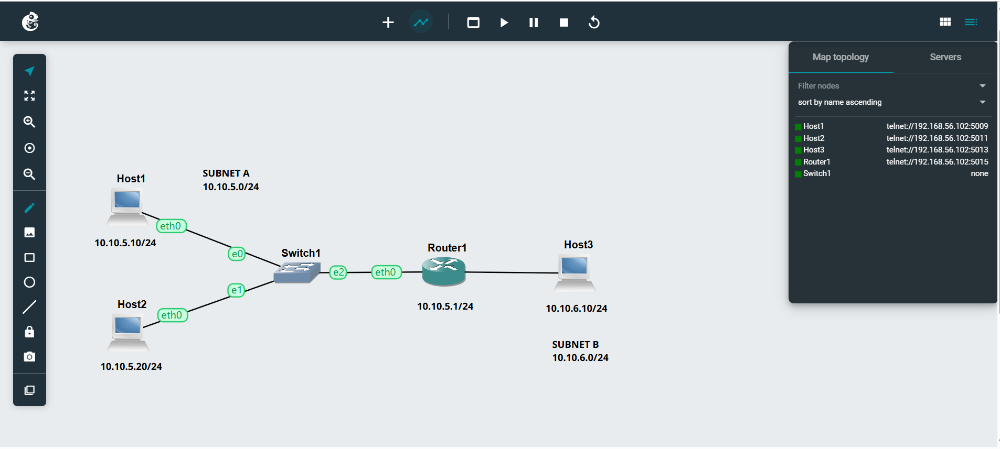

---

## Step 19 – Taking the Ping Screenshot

I took a screenshot showing the successful ping from Host1 in Subnet A to Host3 in Subnet B.

The screenshot showed:

```bash
ping -c 3 10.10.6.10
```

and:

```text
3 packets transmitted, 3 received, 0% packet loss
```

The screenshot was saved as:

```text
View-Routes-12321415-ping.png
```

### Ping Evidence

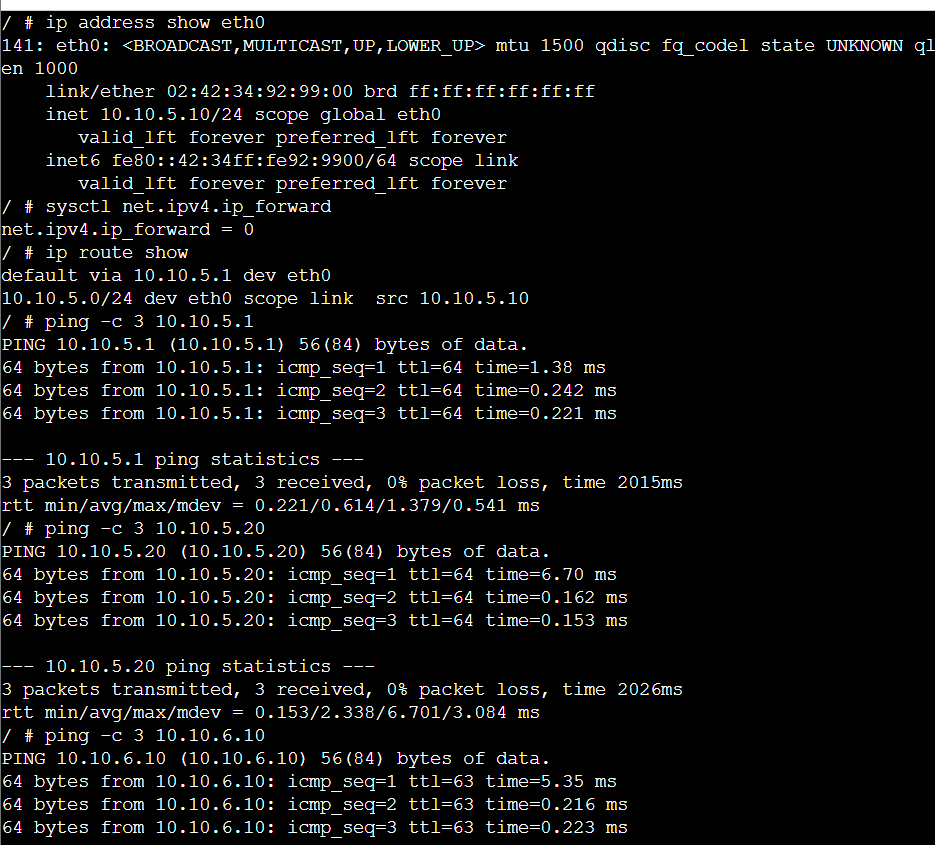

---

# Task 1 Output Files

The final Task 1 files were:

```text
View-Routes-12321415.gns3project
View-Routes-12321415-network.png
View-Routes-12321415-ping.png
```

I also recorded the IP addresses and routing tables of:

```text
Host1
Host2
Host3
Router1
```

---

# Task 2 – Dynamic Routing with OSPF

## Step 1 – Importing the OSPF Project

For Task 2, I used the project provided with the tutorial:

```text
OSPF-Basics-Template.gns3project
```


I imported the project into GNS3.

I then created my own copy named:

```text
OSPF-Basics-12321415
```


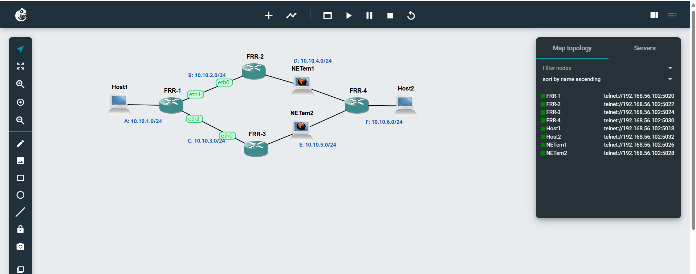


The IP addresses and OSPF settings were already configured in the provided project.

I did not make any changes to the IP addresses or OSPF configuration.

---

## Step 2 – Understanding the OSPF Network

The OSPF project contained:

```text
Host1
Host2

FRR1
FRR2
FRR3
FRR4

Two NETem nodes
```

There were two possible paths between the two hosts.

A simplified view of the network was:

```text
                  FRR2
                 /    \
                /      \
Host1 ----- FRR1        FRR4 ----- Host2
                \      /
                 \    /
                  FRR3
```

The top path travelled through FRR2.

The bottom path travelled through FRR3.

The NETem nodes were used to simulate network links and could be stopped to test how OSPF reacted to a link failure.

---

## Step 3 – Starting All Nodes

I started all nodes in the OSPF project.

The FRR routers took longer to start compared with the normal Linux Hosts.

I waited until the following prompt appeared:

```text
frr#
```

If the router showed:

```text
frr:~#
```

I entered:

```bash
vtysh
```

After this, the FRRouting prompt appeared:

```text
frr#
```

---

## Step 4 – Checking FRR1 OSPF Neighbours

On FRR1, I entered:

```text
show ip ospf neighbor
```

This command displayed the routers that had formed an OSPF neighbour relationship with FRR1.

The output showed information such as:

```text
Neighbor ID
State
Address
Interface
```

I used this information to identify the neighbouring routers connected to FRR1.

---

## Step 5 – Taking the FRR1 Neighbour Screenshot

I took a screenshot showing:

```text
show ip ospf neighbor
```

The screenshot was saved as:

```text
OSPF-Basics-12321415-FRR1-neighbors.png
```

### FRR1 Neighbour Evidence

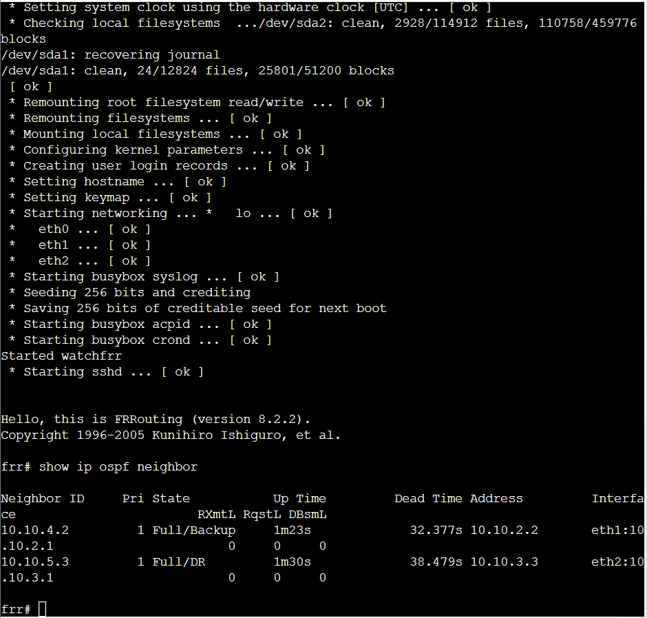

---

## Step 6 – Viewing OSPF Routes on FRR1

On FRR1, I entered:

```text
show ip ospf route
```

This command showed the routes calculated by OSPF.

I checked information such as:

```text
Destination network
Next-hop router
Outgoing interface
```

This helped me understand which route FRR1 was using to reach other networks.

---

## Step 7 – Viewing the Full Routing Table on FRR1

I also entered:

```text
show ip route
```

This displayed the complete routing table.

The routing table contained different route types.

Some of the route codes were:

```text
C = Connected
O = OSPF
L = Local
```

The routes beginning with `O` were routes learned automatically through OSPF.

---

## Step 8 – Taking the FRR1 Routing Table Screenshot

I took a screenshot showing:

```text
show ip route
```

on FRR1.

The screenshot was saved as:

```text
OSPF-Basics-12321415-FRR1-routes.png
```

### FRR1 Routing Table

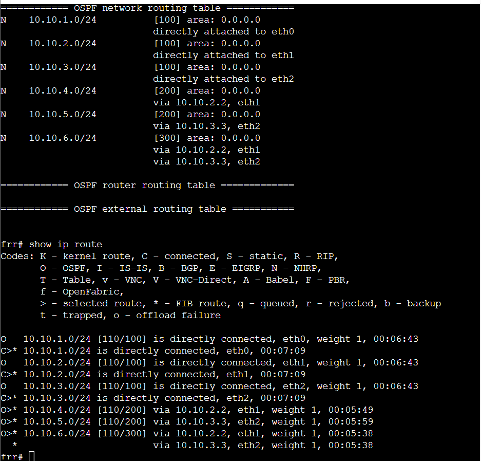

---

## Step 9 – Checking FRR2

On FRR2, I used:

```text
show ip ospf neighbor
show ip ospf route
show ip route
```

I checked the OSPF neighbours, destination networks and next-hop information.

---

## Step 10 – Checking FRR3

On FRR3, I entered:

```text
show ip ospf neighbor
show ip ospf route
show ip route
```

I recorded the routing information shown by FRR3.

---

## Step 11 – Checking FRR4

On FRR4, I entered:

```text
show ip ospf neighbor
show ip ospf route
show ip route
```

I checked the neighbouring routers and routing information in the same way.

---

## Step 12 – Taking the FRR4 Routing Table Screenshot

I took a screenshot showing the routing table on FRR4.

The screenshot was saved as:

```text
OSPF-Basics-12321415-FRR4-routes.png
```

### FRR4 Routing Table

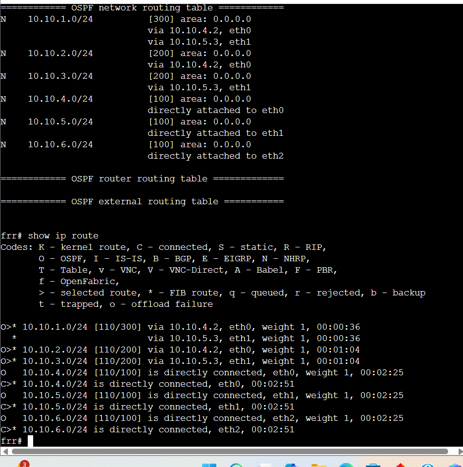

---

# OSPF Routing Summary

I used the information from:

```text
show ip ospf route
```

and:

```text
show ip route
```

to identify the destination networks and next nodes used by each router.

I recorded the information in the following table.

# OSPF Routing Summary

| Router | Destination | Next Node |
|---|---|---|
| FRR1 | `10.10.1.0/24` | Directly connected |
| FRR1 | `10.10.2.0/24` | Directly connected |
| FRR1 | `10.10.3.0/24` | Directly connected |
| FRR1 | `10.10.4.0/24` | `10.10.2.2` |
| FRR1 | `10.10.5.0/24` | `10.10.3.3` |
| FRR1 | `10.10.6.0/24` | `10.10.2.2` or `10.10.3.3` |
| FRR2 | `10.10.1.0/24` | `10.10.2.1` |
| FRR2 | `10.10.2.0/24` | Directly connected |
| FRR2 | `10.10.3.0/24` | `10.10.2.1` |
| FRR2 | `10.10.4.0/24` | Directly connected |
| FRR2 | `10.10.5.0/24` | `10.10.4.4` |
| FRR2 | `10.10.6.0/24` | `10.10.4.4` |
| FRR3 | `10.10.1.0/24` | `10.10.3.1` |
| FRR3 | `10.10.2.0/24` | `10.10.3.1` |
| FRR3 | `10.10.3.0/24` | Directly connected |
| FRR3 | `10.10.4.0/24` | `10.10.5.4` |
| FRR3 | `10.10.5.0/24` | Directly connected |
| FRR3 | `10.10.6.0/24` | `10.10.5.4` |
| FRR4 | `10.10.1.0/24` | `10.10.4.2` or `10.10.5.3` |
| FRR4 | `10.10.2.0/24` | `10.10.4.2` |
| FRR4 | `10.10.3.0/24` | `10.10.5.3` |
| FRR4 | `10.10.4.0/24` | Directly connected |
| FRR4 | `10.10.5.0/24` | Directly connected |
| FRR4 | `10.10.6.0/24` | Directly connected |
The values in this table were taken from the actual routing information shown in the GNS3 project.

---

## Step 13 – Checking Host1 and Host2 IP Addresses

Before using traceroute, I checked the IP addresses of both end hosts.

On Host1, I entered:

```bash
ip address show
```

On Host2, I entered:

```bash
ip address show
```

I recorded the actual IP addresses provided by the OSPF template.

```text
Host1 IP Address: <enter actual Host1 IP>
Host2 IP Address: <enter actual Host2 IP>
```

---

## Step 14 – Testing Host1 to Host2

From Host1, I tested communication with Host2.

I entered:

```bash
ping -c 3 <Host2-IP>
```

The ping was successful.

This confirmed that the OSPF network had a working route between Host1 and Host2.

---

## Step 15 – Running Traceroute Before the Link Failure

To find the path being used between Host1 and Host2, I entered:

```bash
traceroute <Host2-IP>
```

The result displayed each router that the packet travelled through before reaching Host2.

I used the traceroute result to identify whether the current path was using FRR2 or FRR3.

The route was similar to:

```text
Host1
   |
FRR1
   |
FRR2 or FRR3
   |
FRR4
   |
Host2
```

---

## Step 16 – Taking the First Traceroute Screenshot

I saved the first traceroute screenshot as:

```text
OSPF-Basics-12321415-traceroute-before.png
```

### Traceroute Before Link Failure

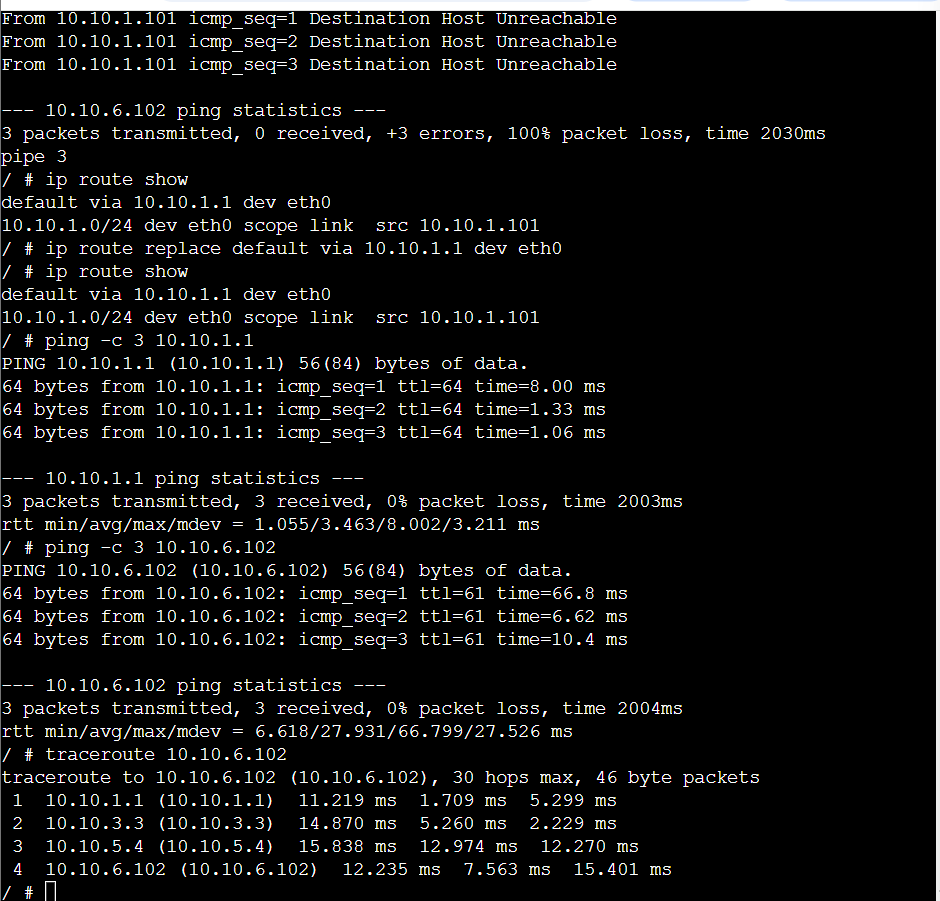

---

## Step 17 – Identifying the Active Path

I checked the first traceroute result to determine which path was being used.

If the traceroute passed through FRR2, then the top path was active.

If the traceroute passed through FRR3, then the bottom path was active.

I identified the active route before making any changes to the network.

---

## Step 18 – Stopping the NETem Node

After identifying the current path, I stopped the NETem node connected to that path.

I did not delete the NETem node.

I only selected:

```text
Stop
```

Stopping the node simulated a network link failure.

---

## Step 19 – Waiting for OSPF to Update

After stopping the NETem node, I waited for the routers to detect the network change.

OSPF automatically recalculated the routing information and selected another available path.

I did not manually add another route because OSPF handled the routing change automatically.

---

## Step 20 – Running Traceroute Again

After waiting for OSPF to update, I returned to Host1.

I entered:

```bash
traceroute <Host2-IP>
```

again.

The second traceroute showed that the packets were travelling through a different path.

For example, if the first route was:

```text
Host1
   |
FRR1
   |
FRR2
   |
FRR4
   |
Host2
```

the new route could become:

```text
Host1
   |
FRR1
   |
FRR3
   |
FRR4
   |
Host2
```

This confirmed that OSPF was able to find another route when the original path became unavailable.

---

## Step 21 – Taking the Second Traceroute Screenshot

I saved the second traceroute screenshot as:

```text
OSPF-Basics-12321415-traceroute-after.png
```

### Traceroute After Link Failure

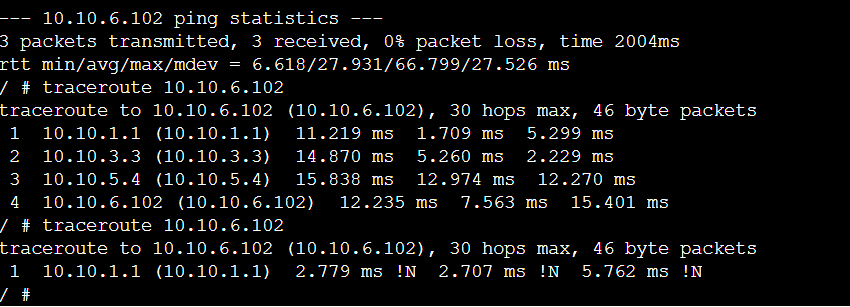

---

## Step 22 – Taking the OSPF Network Screenshot

I arranged all devices clearly in the GNS3 workspace and took a screenshot of the OSPF topology.

The screenshot included:

```text
Host1
Host2
FRR1
FRR2
FRR3
FRR4
NETem nodes
Network links
```

The screenshot was saved as:

```text
OSPF-Basics-12321415-network.png
```

### OSPF Network Screenshot

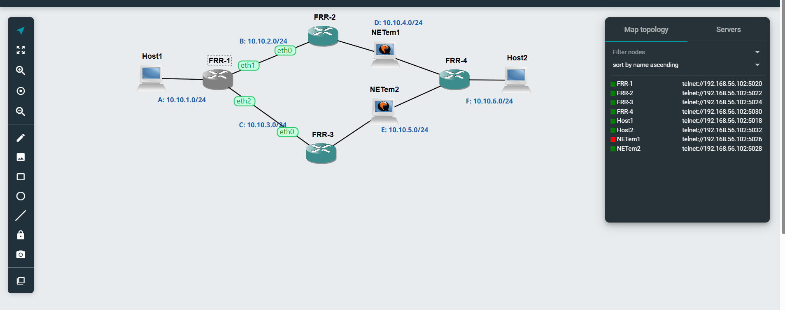

---

# Output Files

## Task 1 – View Routing Tables

The final Task 1 files were:

```text
View-Routes-12321415.gns3project
View-Routes-12321415-network.png
View-Routes-12321415-ping.png
```

I also recorded the IP addresses and routing tables of:

```text
Host1
Host2
Host3
Router1
```

---

## Task 2 – Dynamic Routing with OSPF

The final Task 2 files were:

```text
OSPF-Basics-12321415.gns3project
OSPF-Basics-12321415-network.png
OSPF-Basics-12321415-FRR1-neighbors.png
OSPF-Basics-12321415-FRR1-routes.png
OSPF-Basics-12321415-FRR4-routes.png
OSPF-Basics-12321415-traceroute-before.png
OSPF-Basics-12321415-traceroute-after.png
```

I also recorded the routing information for:

```text
FRR1
FRR2
FRR3
FRR4
```

with the destination and next node information.

---

# Issues Encountered

During Task 1, I had to make sure that IP forwarding was configured correctly.

The Linux Hosts needed:

```text
net.ipv4.ip_forward = 0
```

while Router1 needed:

```text
net.ipv4.ip_forward = 1
```

I checked the setting using:

```bash
sysctl net.ipv4.ip_forward
```

I also had to check the default gateway on each host. Host1 and Host2 used:

```text
10.10.5.1
```

while Host3 used:

```text
10.10.6.1
```

This was important because a host needs a gateway when communicating with a device in another subnet.

In Task 2, the FRR routers took longer to start than normal Linux Hosts. I had to wait until the `frr#` prompt appeared before using the OSPF commands.

I also had to check the first traceroute carefully before stopping a NETem node. This was important because I needed to stop a link that was actually being used by the current route.

After stopping the NETem node, I waited for OSPF to detect the change and update its routing information. Running traceroute again showed that the packets were using another available path.

These steps helped me understand the importance of checking routing information before making changes to a network.

---

# Reflection

This tutorial helped me understand routing tables and dynamic routing in a more practical way.

In Task 1, I learned how a Linux Router can connect two separate subnets. I understood that a host can communicate directly with another device in the same subnet, but it needs a default gateway when communicating with a different network.

I also learned why IP forwarding is important. Forwarding remained disabled on Host1, Host2 and Host3 because they were normal end devices, while it was enabled on Router1 so that packets could travel between the two networks.

Using the `ip route show` command helped me understand how each device decides where a packet should be sent.

Task 2 helped me understand how OSPF provides dynamic routing. Instead of manually creating routes on every router, the FRR routers exchanged routing information and automatically selected a path through the network.

The most useful part of the tutorial was using `traceroute` before and after stopping a NETem node. The first traceroute showed the original route between the hosts. After stopping the active link and allowing OSPF to update, the second traceroute showed a different path.

I also gained more practice using commands such as:

```text
ip address show
ip route show
sysctl net.ipv4.ip_forward
ping
show ip ospf neighbor
show ip ospf route
show ip route
traceroute
```

Overall, this tutorial improved my understanding of routing tables, default gateways, IP forwarding and dynamic routing using OSPF.
