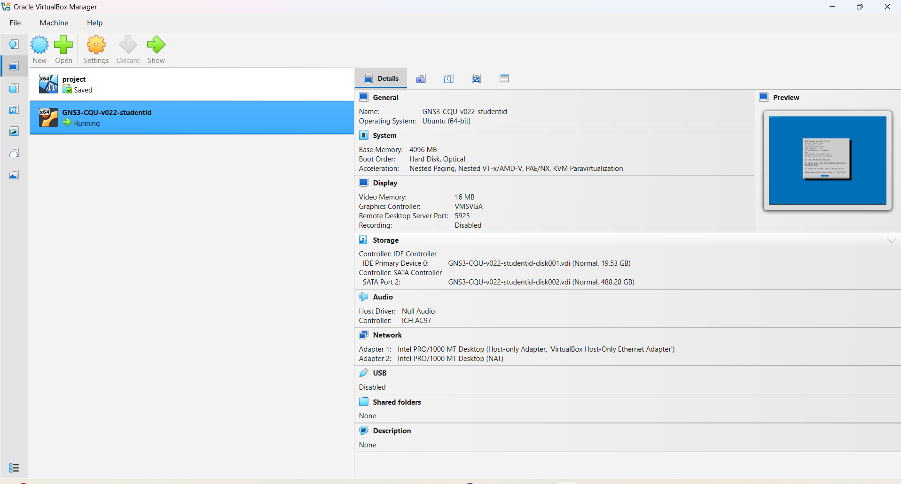

# COIT20261 - Week 01 Portfolio

## Student Information

**Name:** Chandu Yadav  
**Student ID:** 12321415  
**Unit:** COIT20261  
**Term:** 2026 Term 2  

## Section A - Unit and Software Setup

### 1. Understanding the Unit

During Week 01, I reviewed the COIT20261 unit information and tutorial requirements. I familiarised myself with the unit structure, portfolio requirements, practical activities and the software that will be used during the term.

The Week 01 tutorial introduced the basic tools required for networking activities, particularly VirtualBox, GNS3 and GitHub.

### 2. Software Setup

The required software for this unit was checked and successfully configured on my computer.

The software used was:

- Oracle VirtualBox
- GNS3
- Google Chrome for accessing the GNS3 Web UI
- GitHub for storing portfolio files and practical

  images/virtualbox.png
  .

VirtualBox was used to run the CQU-provided GNS3 virtual machine.

#### VirtualBox Setup

The CQU GNS3 virtual machine was successfully imported into Oracle VirtualBox.

The virtual machine was configured with:

- Host-only network adapter
- NAT network adapter
- GNS3 server environment

.

### 3. Starting the GNS3 Server

The CQU GNS3 virtual machine was started successfully in VirtualBox.

After the virtual machine finished booting, the GNS3 server displayed its server details and IP address.

The GNS3 Web UI was available at:

**http://192.168.56.102**

The GNS3 server was then accessed through Google Chrome.

Evidence

Add your GNS3 server/VirtualBox running screenshot below.

### 4. GitHub Repository

A private GitHub repository was created for this unit using the required naming format.

Repository name:

**12321415-COIT20261-2026T2**

The repository is used to store weekly portfolio files, screenshots, GNS3 project files and other evidence produced during the unit.

The repository was also shared with the tutor as required.

## Section B - GNS3 Introduction

### Aim

The aim of this activity was to become familiar with the basic operation of GNS3.

The activity involved:

- Creating a new GNS3 project
- Adding a Linux Host
- Adding text and graphical annotations
- Configuring a static IPv4 address
- Starting and stopping a node
- Opening the Linux Host web console
- Running Linux networking commands
- Verifying the configured IP address
- Exporting the completed GNS3 project

### 1. Creating the GNS3 Project

A new GNS3 project was created with the following name:

**GNS3-Intro-12321415**

A single Linux Host node was added to the project and named:

**Host1**

The project topology also included annotations showing:

- Unit code
- Project title
- Student name
- Student ID
- Date
- Interface name
- IP address
- Subnet mask

A rectangle annotation was also used to organise the Linux Host and its networking information.

### 2. Network Configuration

The following IPv4 configuration was selected for Host1:

**Setting**	      ------               **Value** 
Host	            ------                 Host1 
Interface	        ------                 eth0 
IPv4 Address  	  ------                 10.10.1.1 
Prefix	          ------                 /24 
Subnet Mask       ------                 255.255.255.0 
Gateway	          ------                 Not required 
IP Forwarding     ------              	 Disabled 

The resulting network was a simple single-host network.

### 3. GNS3 Network Topology

The completed GNS3 topology is shown below.

The topology contains one Linux Host named Host1.

The IPv4 address assigned to the eth0 interface was:

 **10.10.1.1/24**

The subnet mask was:

**255.255.255.0**

No gateway was required because the activity only contained a single Linux Host and no router.

### 4. Configuring the Static IP Address

Before starting Host1, the Linux network configuration was edited.

The /etc/network/interfaces configuration used for the activity was:

auto lo
iface lo inet loopback 

auto eth0 
  iface eth0 inet static 
    address 10.10.1.1 
    netmask 255.255.255.0 
    up sysctl net.ipv4.ip_forward=0 

The configuration assigned the static IPv4 address 10.10.1.1 to interface eth0.

The command:

**up sysctl net.ipv4.ip_forward=0**

was also included so that the Linux node would operate as a normal host rather than forwarding IP packets like a router.

### 5. Starting Host1

After completing the network configuration, Host1 was started from the GNS3 Web UI.

The web console was then opened in a new browser tab.

The Linux console provided access to the operating system running inside Host1.

### 6. Verifying the IP Address

The following Linux command was used to display the network interfaces and IP addresses:

**ip address show**

The output showed the eth0 interface with the configured IPv4 address:

**inet 10.10.1.1/24 scope global eth0**

This confirmed that the static IPv4 configuration had been successfully applied.

Evidence

The screenshot confirms that:

- eth0 is available 
- eth0 is UP 
- IPv4 address 10.10.1.1/24 is configured 
- The configured IP address matches the address shown in the GNS3 topology 

Then IP Forwarding is also verified.

### 7. Commands Used

The main commands used during the activity were:

- Display all network interfaces 
- ip address show 
- Check the eth0 interface 
- ip address show eth0 
- Check IP forwarding 
- sysctl net.ipv4.ip_forward 

### 8. Learning

During this tutorial, I learned how VirtualBox and GNS3 work together to provide a virtual networking environment.

I learned how to create a new GNS3 project, add a Linux Host and organise a network topology using text and rectangle annotations.

I also learned how to configure a static IPv4 address using the /etc/network/interfaces file and how to verify network configuration from a Linux terminal.

The command:

**ip address show**

helped me understand how Linux displays interfaces and their assigned IP addresses.

I also learned the purpose of IP forwarding and verified that it was disabled using:

**sysctl net.ipv4.ip_forward**

This activity provided practical experience with GNS3, Linux networking, IPv4 configuration, VirtualBox and documenting technical work using GitHub and Markdown.
